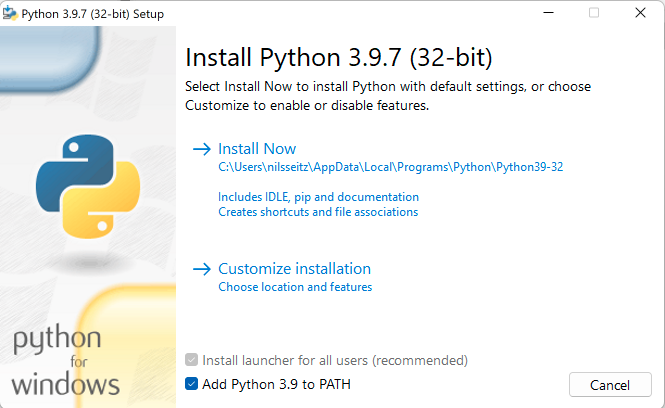
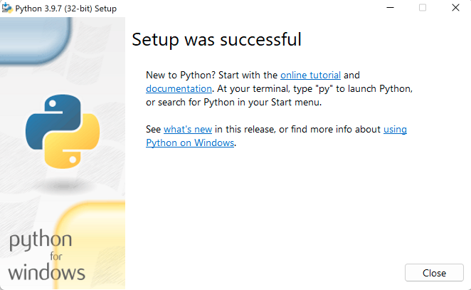
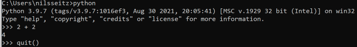
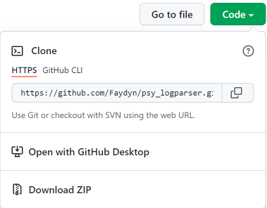
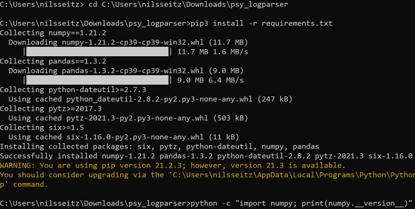

# psy_logparser

###### Copyright © 2021 [Nils Seitz](https://github.com/Faydyn), [Prof. Dr. Alexander Lischke](https://www.researchgate.net/profile/Alexander-Lischke)

 
Parses from files to a certain format, cleans, processes and saves the data.

Parser has multiple parts, that can be chosen individually or chained together
to produce a final, accumulated result. 

It will mostly be used to parse data of studies in Cognitive Neuroscience.

This program came to life to solve a parsing problem for Prof. Dr. Alexander
Lischke.

 

## What do you need to use the parser?

### Option 1: Jupyter Notebook (Browser)

Open
this [Jupyter Notebook on Binder](https://mybinder.org/v2/gh/Faydyn/psy_logparser.git/jupyter)
.

 
 

### Option 2: Python 3 (Local)

__DISCLAIMER__: __Python 3.9.7__ cannot be used on Windows 7 or earlier. 
In Case you only have Windows 7, try installing __Python 3.7.12__ (cannot be
used on Windows XP or earlier), which *should* also work.

The following is a quick guide of a Python Installation primarily for Windows,
with some comments for Unix-based Operating Systems.  
If you already installed __Python 3.9.7__ or higher, you can skip this part.
 
 

#### 1 PYTHON

##### 1.1 __Windows__

###### Download and run Python 3

1. Download __Python 3.9.7__ from
   the [Python Website](https://www.python.org/downloads/release/python-397/).
   Choose either __Windows installer (32-bit)__ or __Windows installer (64-bit,
   recommended)__.
2. Run __python-3.9.7.exe__ as __Administrator__.
3. Check "__Add Python 3.9 to PATH__". (Optional, but recommended)
4. Choose "__Install Now__"
   .   
5. Wait for installation to complete.
6. When done, __Disable Path Length Limit__. (If not already done - thus does
   not show up in picture).
     
7. Close the Installer and remove __python-3.9.7.exe__.

###### Testing Python 3

1. Press __Win+S__ to search for "__cmd__", choose __Command Prompt__ (or
   PowerShell).
2. Inside __Command Prompt__ type: `python`.
3. Check, if it installed correctly and prints out the correct version
   number (__3.9.7__).
4. Do another simple check, like `2 + 2`, which should result in 4 without any
   errors.
5. Type `quit()` to exit Python.
   

 

##### 1.2 __MacOS__

Download Anaconda via Homebrew and simply set up an Environment with Python
3.9.7.

You might need to use `python3` in __Terminal__. Contact me, when issues arise
during this.

##### 1.3 __Linux__

I guess, you know how to do this.

 
 

#### 2 GITHUB

##### 2.1 __Download zip__

Click the green "__Code__" at the top of this page and choose "__Download ZIP__"
. Move the files where you like - as long as you got the permissions to access
the chosen directory.

##### 2.2 __Clone repository__

Choose a directory inside a __Terminal__ (with `cd`, see below) and
type `git clone https://github.com/Faydyn/psy_logparser.git`.

 
 

#### 3 PIP

`pip` is a Package (Dependency) Manager for Python.

###### Using Command-Line to install dependencies

1. Open __Command Prompt__, __PowerShell__ or a __Terminal__ (Unix) of your
   choice.
2. Copy/Type the path of the downloaded/cloned repository (this is `<PATH>`) to
   the Prompt/Shell: `cd <PATH>\psy_logparser`.
3. Type `pip install -r requirements.txt` and `pip3 install -r requirements.txt`
   , but the latter should suffice in most cases.
   

###### Testing dependencies

1. Type `python -c "import numpy; print(numpy.__version__)"`. That should
   be: `1.21.2`.
2. Type `python -c "import pandas; print(pandas.__version__)"`. That should
   be: `1.3.2`.

 
 

## Quick Description of each file

### main

- __parser.ipynb__:  
  Jupyter notebook, that acts as main file (and more) and displays the final
  result.

### constants

- __constants.json__:  
  Constants are defined here. The program load them while running. There are
  different modes configured. 
  __Change values as necessary.__
- __src/constants.py__:  
  Contains the path to __constants.json__ and the mode - it then loads all
  defined constants for that mode. 
  __Change mode as necessary.__ Change path if you moved __constants.json__.

### src

- __src/parser.py__:  
  Does basic File-Path Handling and reads in and saves the (if wanted,
  accumulated) data.
- __src/token.py__:  
  Heart of all Data Manipulation. Splits, converts, rearranges data as defined
  in __constants.json__.

### setup

- __requirements.txt__: Used for setup with __pip__ to guarantee the correct
  version of __numpy__ and __pandas__.

### other

- __README.md__: The documents that is displayed
  on [Github](https://github.com/Faydyn/psy_logparser/tree/master).
- __img__: Contains images for README.
- __LICENSE__: Law stuff.

 
 

## How to use the parser?

### Option 1: Jupyter Notebook (Browser)

1. Create a folder.
2. Navigate inside the folder
3. Upload data there, just Ctrl/Cmd+A and Drag-and-Drop files.
4. Replace `name_of_data_folder` below with the name of created folder.
5. Parsed and accumulated data will be in __results__ to view.
6. Generates a zip on top to download.

  

### Option 2: Python 3 (Local)

__DISCLAIMER__: On Windows, paths used inside __json__ and __py__ files have to
use double backslashes (`\\`) to separate directories. 
E.g.: `"DATA_PATH" : "C:\\Users\\nilsseitz\\Downloads\\data",`

 

#### CONSTANTS

I tried to give self-explanatory names for these constants. If in doubt, don't
change them or ask me.

1. Open __constants.json__.
2. Change paths for __DATA_PATH__ and __SAVE_PATH__. (Double backslashes!)
3. Change other values. (optional)
4. Close __constants.json__.
5. Open __constants.py__ (in __src__).
6. Change __MODE__. (Spell correctly)
    1. __preprocess__:  Converts data to a __csv__ for each file.
    2. __accumulate__:  Accumulates __csv__ files from above to one big __
       csv__.
    3. __default__:  Combines both, __preprocess__ and __accumulate__, and
       does some optimization.
7. Change __JSON_FILEPATH__. (Double backslashes!) 
   (Only, if you moved that file or want to use another config)

 

#### RUN PROGRAM

1. Open up __Command Prompt__, __PowerShell__ or a __Terminal__ (Unix) of your
   choice.
2. Copy/Type the path of the downloaded/cloned repository (this is `<PATH>`) to
   the Prompt/Shell: `cd <PATH>\psy_logparser`.
3. Type `python -m main`
4. Your results should now be in the specified path.

 
 

## What else to know?

- [Example json](https://codeblogmoney.com/what-is-json/)
- [Git Windows](https://git-scm.com/download/win/)
- [Jupyter Guide](https://medium.com/velotio-perspectives/the-ultimate-beginners-guide-to-jupyter-notebooks-6b00846ed2af)

